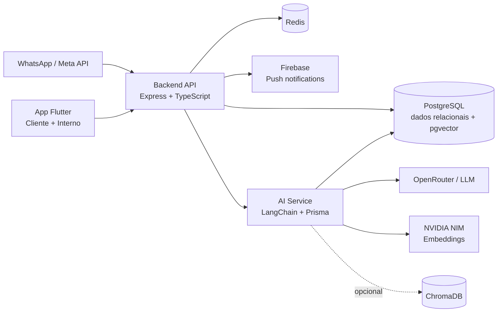

<p align="center">
  
</p>

<h1 align="center">🔧 Tião Oficina</h1>

<p align="center">
  <strong>Borracharia & Oficina Mecânica Inteligente</strong><br />
  Atendimento automatizado via WhatsApp, gestão operacional de oficina e criação de ordens de serviço com IA.
</p>

<p align="center">
  <a href="#-visão-geral">Visão geral</a> •
  <a href="#-arquitetura">Arquitetura</a> •
  <a href="#-tecnologias">Tecnologias</a> •
  <a href="#-quick-start">Quick Start</a> •
  <a href="#-serviços-disponíveis">Serviços</a> •
  <a href="#-desenvolvimento-local">Dev local</a>
</p>

<p align="center">
  
  
  
  
  
  
</p>

---

## ✨ Visão geral

O **Tião Oficina** é uma plataforma full stack para oficinas mecânicas que combina:

| Área | O que entrega |
| --- | --- |
| 💬 **Atendimento WhatsApp** | Webhook da Meta API para receber mensagens, validar contatos e conduzir conversas. |
| 🧠 **Agente de IA** | Serviço LangChain com RAG, busca operacional e criação assistida de ordens de serviço. |
| 🧾 **Gestão da oficina** | Usuários, veículos, produtos, catálogo de serviços, agendamentos, orçamentos e execuções. |
| 📲 **App Flutter** | Experiência para cliente e sistema interno da oficina em um protótipo de alta fidelidade. |
| 🔔 **Notificações** | Integração com Firebase Cloud Messaging para alertas e push tokens. |
| 📊 **Relatórios** | Endpoints e telas internas para acompanhamento operacional. |

> Documentação complementar do app disponível em [`prototipo/README.md`](prototipo/README.md).

---

## 🧭 Arquitetura



### Fluxo principal

1. O cliente chama a oficina pelo WhatsApp ou usa o app.
2. O **Backend** centraliza autenticação, regras de negócio, persistência e webhook.
3. O **AI Service** analisa mensagens, consulta contexto via RAG e aciona ferramentas internas.
4. Produtos, serviços, orçamentos, agendamentos e execuções são sincronizados para busca vetorial.
5. A equipe acompanha tudo pelo sistema interno Flutter.

---

## 🧱 Estrutura do projeto

```text
.
├── ai_service/          # Serviço de IA, RAG, LangChain, Prisma e embeddings
├── backend/             # API REST, webhook WhatsApp, auth, Swagger, Firebase
├── infra/docker/        # Docker Compose da stack local
├── packages/            # Espaço para pacotes compartilháveis
├── prototipo/           # App Flutter: cliente + sistema interno
├── shared/              # DTOs TypeScript compartilhados
└── README.md            # Você está aqui
```

---

## 🚀 Tecnologias

### Backend API

| Tecnologia | Uso |
| --- | --- |
| 🟦 **TypeScript** | Tipagem e organização da API. |
| 🟩 **Node.js + Express** | Servidor HTTP, rotas REST e webhook WhatsApp. |
| 🔐 **JWT + bcrypt** | Autenticação, autorização e senhas seguras. |
| 🧪 **Zod** | Validação de dados. |
| 📘 **Swagger** | Documentação interativa em ambiente de desenvolvimento. |
| 🔥 **Firebase Admin** | Push notifications via FCM. |
| 🐘 **PostgreSQL** | Banco relacional principal. |
| 🧬 **pgvector** | Tabelas de embeddings e busca semântica. |

### AI Service

| Tecnologia | Uso |
| --- | --- |
| 🧠 **LangChain** | Orquestração do agente, ferramentas e contexto. |
| 🤖 **OpenRouter / ChatOpenAI** | Provedor de modelo conversacional configurável. |
| ⚡ **NVIDIA NIM** | Geração de embeddings. |
| 🔺 **Prisma** | Acesso tipado ao PostgreSQL. |
| 📚 **RAG** | Busca semântica em produtos, serviços, documentos e dados operacionais. |
| 🧩 **Tools internas** | Consulta de catálogo, histórico, disponibilidade e criação de OS. |

### Aplicativo

| Tecnologia | Uso |
| --- | --- |
| 💙 **Flutter + Dart** | App multiplataforma. |
| 🎨 **Google Fonts** | Identidade visual do protótipo. |
| 🔔 **firebase_messaging** | Notificações push no app. |
| 🌐 **http** | Consumo das APIs REST. |
| 💾 **shared_preferences** | Persistência local simples. |

### Infraestrutura local

| Serviço | Papel |
| --- | --- |
| 🐳 **Docker Compose** | Sobe a stack local completa. |
| 🐘 **PostgreSQL 16** | Banco principal. |
| 🟥 **Redis 7** | Serviço disponível para cache/estado. |
| 🧲 **ChromaDB** | Vector store disponível na stack local. |
| 🛠️ **pgAdmin** | Interface opcional para administrar o banco. |

---

## ✅ Pré-requisitos

- [Docker](https://docs.docker.com/get-docker/) e [Docker Compose](https://docs.docker.com/compose/)
- [Node.js](https://nodejs.org/) 20+ para desenvolvimento local
- [Flutter SDK](https://docs.flutter.dev/get-started/install) para rodar o app
- Credenciais do Firebase Admin (`firebase-service-account.json`)
- Chave da Meta/WhatsApp Business API para o webhook
- Chave do provedor de LLM (`OPENROUTER_API_KEY`) e chave NVIDIA para embeddings (`NVIDIA_API_KEY`)

> ⚠️ O banco precisa da extensão **pgvector** habilitada. As migrations tentam executar `CREATE EXTENSION IF NOT EXISTS vector;`.

---

## ⚡ Quick Start

### 1. Clone e entre no projeto

```bash
git clone <url-do-repositorio>
cd desafiociclooficina
```

### 2. Crie os arquivos de ambiente

**Linux/macOS/Git Bash**

```bash
cp backend/.env.example backend/.env
cp ai_service/.env.example ai_service/.env
cp prototipo/lib/core/config/api_config.dart.example prototipo/lib/core/config/api_config.dart
```

**PowerShell**

```powershell
Copy-Item backend/.env.example backend/.env
Copy-Item ai_service/.env.example ai_service/.env
Copy-Item prototipo/lib/core/config/api_config.dart.example prototipo/lib/core/config/api_config.dart
```

### 3. Configure os segredos

Edite os arquivos criados:

- `backend/.env`
- `ai_service/.env`
- `prototipo/lib/core/config/api_config.dart`

Se alguma variável obrigatória não existir no template da sua branch, adicione manualmente no `.env` correspondente.

No Flutter, ajuste `_localIp` para:

| Ambiente | Valor sugerido |
| --- | --- |
| Web/Chrome | `localhost` já é usado automaticamente |
| Emulador Android | `10.0.2.2` |
| Celular físico | IP da sua máquina na rede, exemplo `192.168.0.10` |

### 4. Adicione as credenciais Firebase

No [Firebase Console](https://console.firebase.google.com/):

1. Abra **Configurações do projeto**.
2. Vá em **Contas de serviço**.
3. Clique em **Gerar nova chave privada**.
4. Salve o arquivo como:

```text
backend/firebase-service-account.json
```

> 🔒 Esse arquivo fica fora do Git via `.gitignore`/`.dockerignore`.

### 5. Suba a stack

```bash
docker compose -f infra/docker/docker-compose.yml up -d --build
```

Veja logs em tempo real:

```bash
docker compose -f infra/docker/docker-compose.yml logs -f
```

Confira os containers:

```bash
docker compose -f infra/docker/docker-compose.yml ps
```

### 6. Rode migrations e seed

O backend executa migrations idempotentes no startup. Para forçar manualmente ou rodar após reset de volumes:

```bash
docker compose -f infra/docker/docker-compose.yml exec backend node dist/backend/src/database/migrations/migrations.js
```

Popule dados iniciais de desenvolvimento:

```bash
docker compose -f infra/docker/docker-compose.yml exec backend node dist/backend/src/database/seeds/seeds.js
```

### 7. Abra as URLs principais

- API: <http://localhost:3000>
- Swagger: <http://localhost:3000/api-docs>
- AI Service: <http://localhost:3001>
- pgAdmin opcional: <http://localhost:5050>

---

## 🔐 Variáveis de ambiente

### `backend/.env`

| Variável | Obrigatória | Descrição |
| --- | --- | --- |
| `DATABASE_URL` | ✅ | Conexão PostgreSQL. No Docker, o compose sobrescreve para usar o host `postgres`. |
| `JWT_SECRET` | ✅ | Segredo usado para assinar tokens JWT. |
| `JWT_EXPIRATION` | ✅ | Tempo de validade do token, exemplo `30d`. |
| `INTERNAL_AUTH_TOKEN` | ✅ | Token compartilhado entre backend e AI Service. |
| `VERIFY_TOKEN` | ✅ | Token de verificação do webhook Meta. |
| `WA_PHONE_NUMBER_ID` | ✅ | ID do número WhatsApp Business. |
| `WA_BUSINESS_ACCOUNT_ID` | ✅ | ID da conta Business. |
| `WA_ACCESS_TOKEN` | ✅ | Token de acesso da Meta API. |
| `AI_SERVICE_URL` | ✅ | URL do AI Service. No Docker: `http://ai_service:3001`. |
| `FIREBASE_SERVICE_ACCOUNT_PATH` | ✅ | Caminho do JSON de credenciais Firebase. |
| `ADMIN_*`, `MECANICO_*`, `CLIENTE_*` | Opcional | Dados usados pelo seed inicial. |

### `ai_service/.env`

| Variável | Obrigatória | Descrição |
| --- | --- | --- |
| `DATABASE_URL` | ✅ | Conexão PostgreSQL compartilhada. |
| `INTERNAL_AUTH_TOKEN` | ✅ | Deve ser igual ao token do backend. |
| `OPENROUTER_API_KEY` | ✅ | Chave para o modelo conversacional. |
| `OPENROUTER_BASE_URL` | Opcional | Padrão: `https://openrouter.ai/api/v1`. |
| `AI_MODEL` | ✅ | Nome do modelo usado pelo agente. |
| `NVIDIA_API_KEY` | ✅ | Chave para embeddings NVIDIA NIM. |
| `NVIDIA_BASE_URL` | ✅ | Endpoint de embeddings, exemplo `https://integrate.api.nvidia.com/v1`. |
| `EMBEDDING_MODEL` | ✅ | Modelo de embedding. |
| `RAG_SPLITTING_STRATEGY` | Opcional | Estratégia de divisão de documentos. |
| `SYSTEM_PROMPT` | Opcional | Prompt base do agente. |
| `LANGCHAIN_*` | Opcional | Observabilidade no LangSmith. |

---

## 🌐 Serviços disponíveis

| Serviço | URL local | Descrição |
| --- | --- | --- |
| 🔌 Backend API | <http://localhost:3000> | API REST principal. |
| 📘 Swagger | <http://localhost:3000/api-docs> | Documentação interativa em dev. |
| 💬 Webhook WhatsApp | <http://localhost:3000/whatsapp> | Validação e recebimento de mensagens Meta. |
| 🧠 AI Service | <http://localhost:3001> | Rotas internas `/ai/*`, protegidas por `X-Internal-Token`. |
| 🐘 PostgreSQL | `localhost:5432` | Banco relacional e vetorial. |
| 🟥 Redis | `localhost:6379` | Serviço disponível para cache/estado. |
| 🧲 ChromaDB | <http://localhost:8000> | Vector store disponível na stack. |
| 🛠️ pgAdmin | <http://localhost:5050> | Interface opcional para o PostgreSQL. |

### Subir pgAdmin

```bash
docker compose -f infra/docker/docker-compose.yml --profile tools up -d pgadmin
```

Login padrão, caso não altere via `.env`:

```text
E-mail: admin@tiao.local
Senha: admin
```

---

## 🧪 Scripts úteis

### Backend

```bash
cd backend
npm install
npm run dev
npm run build
npm start
npm run db:migrate
npm run db:seed
```

### AI Service

```bash
cd ai_service
npm install
npx prisma generate
npm run dev
npm run ingest
```

### Flutter

```bash
cd prototipo
flutter pub get
flutter run -d chrome
```

Outros targets comuns:

```bash
flutter run              # device/emulador detectado
flutter run -d windows   # Windows desktop
```

---

## 📲 Desenvolvimento local

### Backend fora do Docker

```bash
cd backend
npm install
npm run dev
```

Garanta que `backend/.env` aponta para um PostgreSQL acessível e com `pgvector`.

### AI Service fora do Docker

```bash
cd ai_service
npm install
npx prisma generate
npm run dev
```

As rotas internas esperam o header:

```http
X-Internal-Token: <valor-de-INTERNAL_AUTH_TOKEN>
```

### App Flutter

```bash
cd prototipo
flutter pub get
flutter run -d chrome
```

Para rodar em celular físico, configure `prototipo/lib/core/config/api_config.dart` com o IP da máquina que está executando o backend.

---

## 🧠 Endpoints de IA

As rotas do AI Service são internas e devem ser chamadas pelo backend com `X-Internal-Token`.

| Método | Rota | Função |
| --- | --- | --- |
| `POST` | `/ai/analyze` | Analisa mensagem do cliente com contexto RAG. |
| `POST` | `/ai/create-os` | Executa workflow de criação de ordem de serviço. |
| `POST` | `/ai/produtos/sync` | Indexa produto no vetor. |
| `POST` | `/ai/servicos/sync` | Indexa serviço no vetor. |
| `POST` | `/ai/agendamentos/sync` | Indexa agendamento no vetor. |
| `POST` | `/ai/orcamentos/sync` | Indexa orçamento no vetor. |
| `POST` | `/ai/execucoes/sync` | Indexa execução de serviço no vetor. |

---

## 🧹 Parar, limpar e resetar

Parar containers mantendo volumes:

```bash
docker compose -f infra/docker/docker-compose.yml down
```

Parar e apagar volumes:

```bash
docker compose -f infra/docker/docker-compose.yml down -v
```

> ⚠️ `down -v` remove dados do PostgreSQL, Redis, ChromaDB e pgAdmin.

Resetar o banco pelo backend:

```bash
cd backend
npm run db:reset
```

---

## 🩺 Troubleshooting

| Problema | Caminho de solução |
| --- | --- |
| `firebase-service-account.json` não encontrado | Confirme se o arquivo está em `backend/firebase-service-account.json`. |
| Erro ao habilitar `vector` | Use um PostgreSQL com extensão `pgvector` instalada. |
| App no celular não acessa API | Use o IP da máquina no `api_config.dart` e confirme firewall/rede. |
| AI Service retorna erro de autenticação | Verifique se `INTERNAL_AUTH_TOKEN` é igual no backend e no AI Service. |
| Modelo de IA não inicia | Confirme `OPENROUTER_API_KEY` e `AI_MODEL`. |
| Embeddings falham | Confirme `NVIDIA_API_KEY`, `NVIDIA_BASE_URL` e `EMBEDDING_MODEL`. |
| Swagger não aparece | A rota `/api-docs` só é exposta quando `NODE_ENV !== production`. |

---

## 🔒 Segurança

- Nunca versionar `.env`.
- Nunca versionar `backend/firebase-service-account.json`.
- Não expor `WA_ACCESS_TOKEN`, `JWT_SECRET`, `INTERNAL_AUTH_TOKEN` ou chaves de IA.
- Em produção, usar secrets gerenciados pela infraestrutura.
- As rotas internas do AI Service devem permanecer protegidas por `X-Internal-Token`.

---

## 🗺️ Roadmap sugerido

- [ ] Consolidar health checks HTTP para backend e AI Service.
- [ ] Criar pipeline CI com build, lint e testes.
- [ ] Versionar migrations Prisma caso o AI Service passe a gerenciar schema próprio.
- [ ] Adicionar coleção Postman/Insomnia para QA manual.
- [ ] Publicar documentação técnica em `/docs`.

---

<p align="center">
  Feito para acelerar o atendimento, organizar a operação e deixar a oficina pronta para trabalhar com IA de verdade.
</p>
